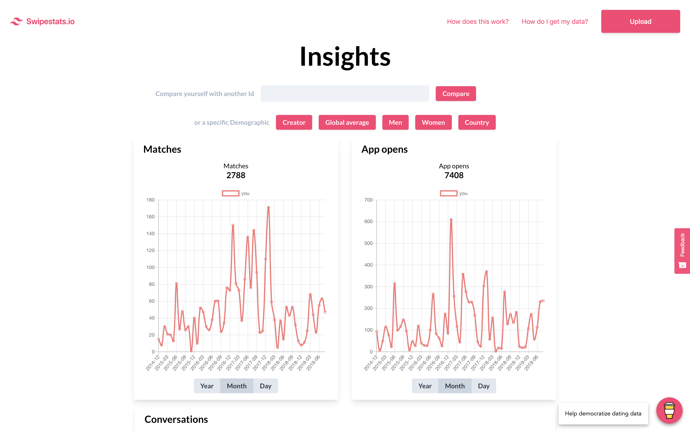

# Swipestats.io

> Visualize your dating data

## How to use

1. Get your data from Tinder from this [link](https://account.gotinder.com/request-data)
2. Parse the the data.json file in [swipestats.io](https://swipestats.io)
3. Upload the anonymized version
4. View insights and graphs

## Privacy

Swipestats generates a unique id for you by hashing your email and account creation date with the md5 algorithm. This way the email, or any other personal information, never reaches the server and total privacy is maintained.

[md5 NPM](https://www.npmjs.com/package/md5)

[md5 Wikipedia](https://en.wikipedia.org/wiki/MD5)

## Demo

